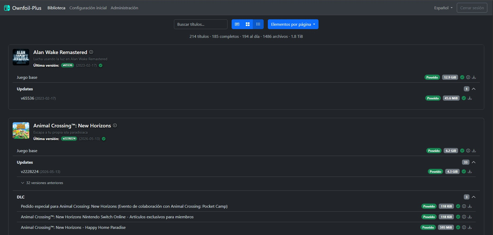
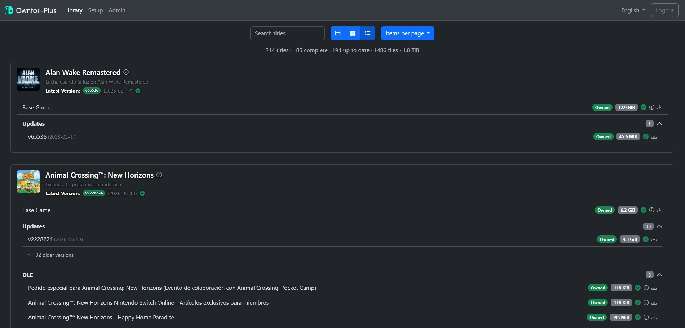
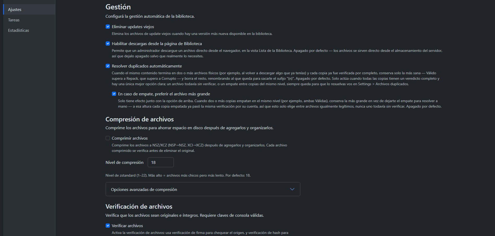
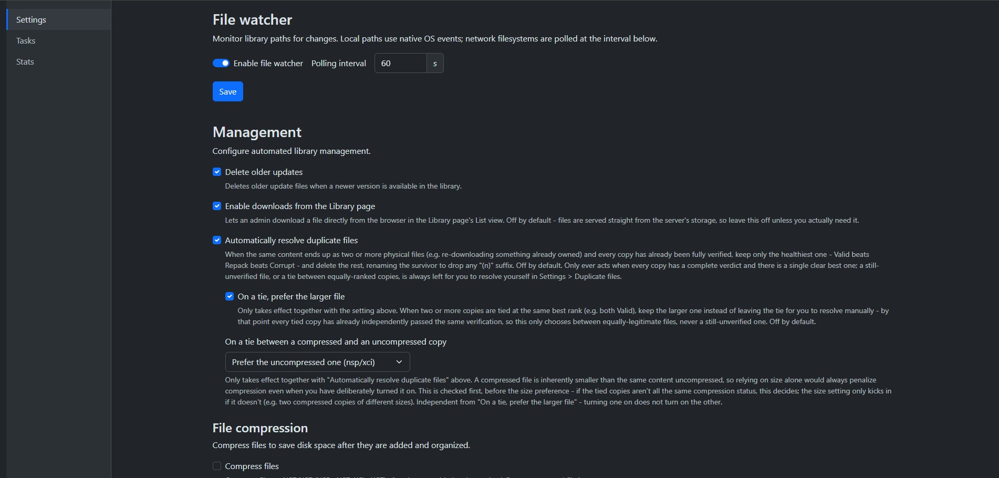
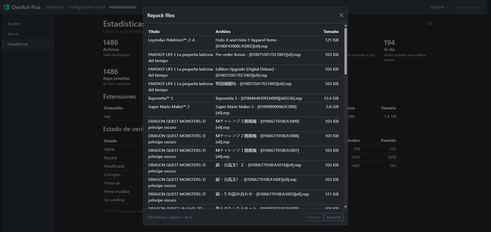
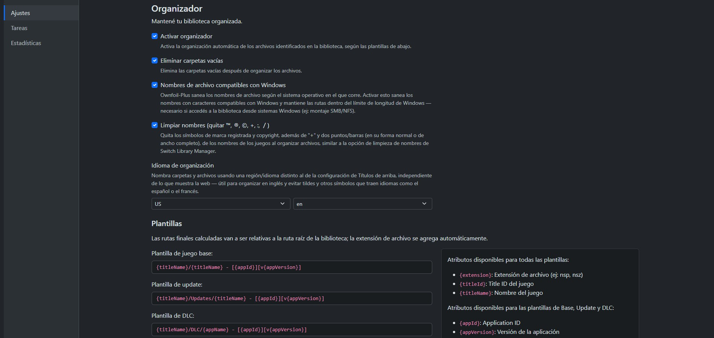

#  Ownfoil-Plus

  

  

<table>
  <tr>
    <td></td>
    <td></td>
  </tr>
  <tr>
    <td></td>
    <td></td>
  </tr>
  <tr>
    <td></td>
    <td></td>
  </tr>
</table>

Ownfoil-Plus is a Switch library manager, that will also turn your library into a fully customizable and self-hosted Shop, supporting multiple clients. The goal of this project is to manage your library, identify any missing content (DLCs or updates) and provide a user friendly way to browse and install your content. Some of the features include:
- multi user authentication
- 🇬🇧🇪🇸 **full web interface in English and Spanish**, switch anytime from the navbar
- content identification using content decryption or filename
- automatic library organization, verification and compression
- automatic and manual duplicate file resolution
- console keys management
- multiple clients support
- shop customization
- settings backup and restore from the web UI

# About this fork

Ownfoil-Plus is a fork of [Ownfoil](https://github.com/a1ex4/ownfoil), created by
[@a1ex4](https://github.com/a1ex4), distributed under the same **GNU AGPLv3**
license. On top of the original project, this fork adds:

- 🇬🇧🇪🇸 A full Spanish/English web interface, switch anytime from the navbar
- A List view showing every game with its updates and DLC in one place, including what's still missing from your library
- A filter to quickly find titles that are complete, incomplete, or have a corrupt or repack file anywhere in them
- A richer game info panel - genre, players, rating, languages, file size, and screenshots - opens from any view (List, Card, or Icon) by clicking the cover
- Editable game info: fix or fill in a title's name, developer, description, and more by hand, and it stays that way even after the catalogue updates
- Local caching of game artwork, so covers and banners keep working even if the remote image host is unreachable
- Duplicate file detection and resolution, both automatic (with your choice of preferring the larger file or the compressed one) and manual, one at a time or in bulk
- A live view of what's actually happening in the background - task progress and what each worker is doing, in real time
- A direct "Verify library now" action, and other library management improvements
- Settings export/import from the web UI

The Docker image for this fork is published at [estebankzl/ownfoil-plus](https://hub.docker.com/r/estebankzl/ownfoil-plus).

See [CHANGELOG.md](./CHANGELOG.md) for what changed in each version.

# Installation

Head over to [Install.md](./Install.md) for the full instructions:

- [Using Docker](./Install.md#using-docker)
- [Using the Helm chart](./Install.md#using-the-helm-chart)

> [!CAUTION]
> There is __no website associated with this project__, only this GitHub repo.  
> Ownfoil-Plus is __not released as an application or an executable file__ - DO NOT download or execute anything related to Ownfoil-Plus outside of this repository and its instructions.

# Usage

Configuring your shop, your clients and every setting available is documented in [Usage.md](./Usage.md). Start with [First steps](./Usage.md#first-steps), or jump straight to the [settings reference](./Usage.md#settings-reference).

# Credits

Ownfoil-Plus builds on [Ownfoil](https://github.com/a1ex4/ownfoil), created by
[@a1ex4](https://github.com/a1ex4) - full credit to them and every contributor to
the original project.

Thanks also to the following projects and their maintainers for making Ownfoil
possible in the first place:
- [@blawar](https://github.com/blawar) for Tinfoil, Fs, the nsz format, TitleDB
- [@nicoboss](https://github.com/nicoboss) for [nsz](https://github.com/nicoboss/nsz)
- [@seiya-dev](https://github.com/seiya-dev) for [NSTools](https://github.com/seiya-dev/NSTools)
